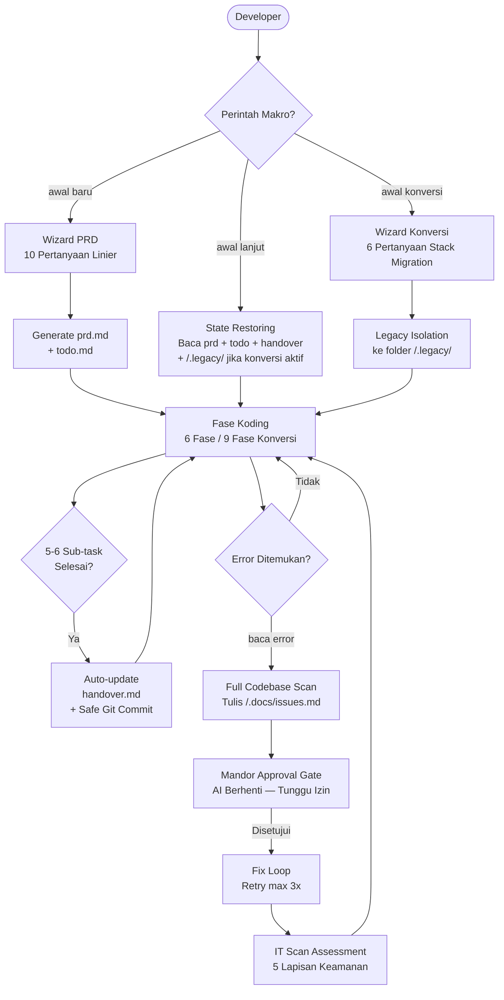

<div align="center">

# 🧠 Brainvibes

### _Global AI Coding Configuration System_

**Sistem Konfigurasi & Standarisasi Alur Kerja AI Coding Agent**

[](https://github.com/Noisesless/brainvibes)
[](https://github.com/google-gemini/gemini-cli)
[](#)
[](#)
[](LICENSE)

---

*Sistem instruksi global berbasis Markdown untuk menstandarisasi tata kelola arsitektur,*
*keamanan aplikasi, konsistensi antarmuka visual, dan pengelolaan konteks pada AI coding agent.*

</div>

---

## Apa Itu Brainvibes?

**Brainvibes** adalah konfigurasi sistem berbasis Markdown untuk AI coding agent (seperti Google Gemini CLI, Antigravity IDE, Cursor, dan GitHub Copilot). Sistem ini mendefinisikan aturan interaksi, arsitektur proyek, standar keamanan aplikasi, konsistensi visual berbasis token, dan alur kerja terstruktur yang dimuat secara otomatis di setiap sesi kerja tanpa perlu konfigurasi ulang manual.

---

## Struktur Ekosistem

### Berkas Inti & Tools Tambahan

| File / Direktori | Ukuran | Fungsi |
| :--- | :--- | :--- |
| [`gemini.md`](gemini.md) | ~29KB | **Instruksi Sistem Inti** — Aturan global agent, protokol sesi, saklar utama, gate visual & keamanan, manajemen context budget, dan format respon. |
| [`gemini-execution.md`](gemini-execution.md) | ~56KB | **Panduan Eksekusi Teknis** — Standarisasi penulisan kode, arsitektur modular, upload pipeline, §3.B.7 Dual-Mode Handover Engine, §4K Visual Design Pipeline, dan verifikasi kelayakan kode. |
| [`gemini-templates.md`](gemini-templates.md) | ~26KB | **Template & Perintah Makro** — Prosedur 11 makro command (§2A-§2K), template debug issues.md, alur sanitasi 5 tahap Git Commit, dan format handover. |
| [`prd-template.md`](prd-template.md) | ~29KB | **Template PRD** — Standar dokumen spesifikasi produk 11-bab, batasan identitas inti aplikasi, dan spesifikasi arsitektur. |
| [`design-system.md`](design-system.md) | ~44KB | **Design System** — Spesifikasi token CSS (oklch), arsitektur layer, tipografi, dan registri token komponen UI (§7B). |
| [`AGENTS.md`](AGENTS.md) | ~8KB | **L1 Switch Dispatcher** — Tabel routing cepat in-memory (11 saklar), deteksi drift Git status, fallback path dinamis, dan registri skills. |
| [`user-prefs.md`](user-prefs.md) | ~7KB | **Preferensi Pengguna** — Default port, tema visual, toggle perilaku agent, whitelist context7, style respon, dan pencarian web. |
| [`config/mcp_config.json`](config/mcp_config.json) | ~0.5KB | **Konfigurasi MCP** — Konfigurasi server MCP lokal (codebase-memory) dan remote (context7). |
| [`sync.ps1`](sync.ps1) & [`sync.sh`](sync.sh) | ~7KB | **Skrip Sinkronisasi (Dual-Platform)** — Otomatisasi sinkronisasi ke direktori `~/.gemini/` (Windows PowerShell & Unix Bash), konfigurasi MCP, dan verifikasi daemon CBM. |
| [`scripts/`](scripts/) | ~6KB | **Skrip Otomasi** — Skrip pendukung daemon CBM (`ensure-cbm-daemon`), pengindeksan repositori (`index-project`), dan hook IDE (`cbm-hook`). |
| [`.gitattributes`](.gitattributes) | ~0.3KB | **Git Attributes** — Normalisasi format line ending lintas platform (LF untuk shell/markdown/json, CRLF untuk powershell). |
| [`yasei-cli.ps1`](yasei-cli.ps1) | ~25KB | **Yasei-2 CLI** — Subsistem terminal asisten koding alternatif untuk membaca dan menulis berkas secara otomatis. |
| `LICENSE` | ~36KB | Lisensi MIT |
| `WORKFLOW_SIMULATIONS.md` | ~15KB | **Simulasi Alur Kerja** — Panduan dan log pengujian skenario eksekusi makro command. |

### Skills System (12 Skill Folders)

| Skill | Trigger Keywords | Fungsi |
| :--- | :--- | :--- |
| `ui-ux-pro-max` | awal baru, redesign | **UUPM v2.13.0** — Design intelligence dengan 18 dataset (192 palet warna, 79 style UI, 74 font pairing, 193 reasoning rules, 119 pedoman UX, 17 preset motion GSAP, 22 stack templates), CLI Three Dials (`--variance`/`--motion`/`--density`), `reasoning_contract.py`, dan validasi data. |
| `taste-skill-bridge` | buat halaman, landing page, UI baru, ubah bentuk, ubah tampilan, ubah layout, perbaiki halaman, redesign visual, ubah visual | Bridging prinsip anti-slop frontend, Three Dials, section rhythm scoring, dan panduan mitigasi degradasi visual UI. |
| `security-patterns` | cek komponen, cek kelengkapan, verifikasi kode | Basis data kerentanan dan pola pengkodean aman per-stack (27 Security Patterns, keselarasan OWASP Top 10). |
| `code-snippets` | buat form, buat navbar, buat modal | Pustaka snippet komponen antarmuka dan pola autentikasi siap pakai. |
| `database-patterns` | desain database, migration | Panduan perancangan skema database, migrasi data, dan optimasi query/ORM. |
| `lessons-learned` | baca error, jangan ulangi | Katalog solusi dan pencegahan pola error berulang dari proyek terdahulu. |
| `pentest-strix` | pentest, pentest cepat, dast | Dynamic Application Security Testing (DAST) menggunakan agen pengujian penetrasi Strix berbasis Docker. |
| `accessibility-audit` | audit a11y, WCAG | Daftar periksa kepatuhan standar aksesibilitas web WCAG 2.2 AA. |
| `performance-audit` | audit performa, lighthouse | Panduan optimasi web performance dan Core Web Vitals. |
| `deployment-checklist` | deploy, hosting, go live | Daftar periksa persiapan rilis aplikasi ke berbagai platform hosting. |
| `git-workflow` | commit, push, branch | Protokol manajemen version control Git, sanitasi data sensitif, dan Conventional Commits. |
| `quick-scaffold` | buat komponen, buat model, buat controller | Generator boilerplate berkas komponen, model, dan controller per-stack. |

### Smart Skill Integration (SSI) System

Brainvibes mengimplementasikan modul **Smart Skill Integration (SSI)** untuk mendeteksi, memvalidasi dependensi, dan mengintegrasikan skill tambahan ke dalam direktori `config/skills/` secara terstruktur.

**Alur Kerja Integrasi:**
```
1. Penambahan folder skill ke config/skills/<nama-skill>/
2. Pemeriksaan skill terdaftar pada inisialisasi sesi
3. Validasi potensi konflik dan dependensi (5-point checklist)
4. Rekomendasi integrasi dan pembaruan trigger
5. Pembaruan indeks skill di .skill-index.json
```

**Fitur Utama:**
- **Deteksi Otomatis:** Memeriksa penambahan folder skill di `config/skills/`.
- **Validasi Ketergantungan:** Memeriksa trigger, ketersediaan dataset, logika eksekusi, dan potensi konflik penamaan.
- **Penyatuan Trigger:** Menggabungkan kata kunci pemicu ke registri `AGENTS.md`.
- **Indeks Terpusat:** Sinkronisasi metadata otomatis pada `.skill-index.json`.

> Detail: `config/skills/integration-checker.md`

### Analisis Kode Sumber & Graph Dependensi (`codebase-memory-mcp`)

Brainvibes mengintegrasikan server MCP **`codebase-memory-mcp`** (CBM v0.10.8) untuk analisis struktur kode berbasis graph AST dan pencarian semantik:

- **15 Graph Tools:** Tool analisis kode seperti `index_repository`, `search_graph`, `query_graph`, `trace_path`, `get_code_snippet`, `get_architecture`, `detect_changes`, dan `manage_adr`.
- **Visualisasi Web 3D:** Antarmuka visualisasi graf interaktif yang dapat diakses di `http://localhost:9749/`.
- **Otomasi Siklus Hidup IDE:** Hook `PreInvocation` (`hooks.json`, `cbm-hook.sh` / `cbm-hook.ps1`) untuk memastikan daemon CBM aktif di latar belakang saat IDE digunakan.
- **Skrip Indexing:** Skrip pembantu (`scripts/index-project.sh` / `scripts/index-project.ps1`) untuk memindai repositori proyek secara cepat.
- **Pemeriksaan Sinkronisasi:** Verifikasi status port dan dependensi CBM pada saat eksekusi `sync.sh` atau `sync.ps1`.


### Knowledge Items (3 Knowledge Bases)

| Knowledge | Isi | Fungsi |
| :--- | :--- | :--- |
| `error-solutions/` | 4 file (PHP, Next.js, CSS oklch, XAMPP) | Solusi error dari proyek nyata — dibaca saat `baca error` |
| `project-retrospectives/` | 1 retro + template | Post-mortem proyek — dibaca saat `awal baru` |
| `vibes-stack-patterns/` | 3 file (PHP, Next.js, CSS) | Proven code patterns — dibaca saat menulis kode |

### Dokumentasi Utama (/.docs/ — 9 File)

Brainvibes mendefinisikan **9 file dokumentasi utama** yang wajib ada di setiap proyek (`/.docs/`):

| # | File | Isi | Brainvibes Status |
|---|---|---|---|
| 1 | `architecture.md` | Makro arsitektur, layer separation (Presentation/Logic/Data), file loading protocol, token efficiency strategy | Active |
| 2 | `api-spec.md` | MCP server endpoints (codebase-memory, context7), macro command triggers, data flow AI→Project & Project→AI | Active |
| 3 | `database.md` | Schema template (users, sessions, projects, tasks), runtime storage (JSON-based), index strategy, performance notes | Active |
| 4 | `dependency-graph.md` | Critical files (gemini.md, user-prefs.md, AGENTS.md), high-impact files, leaf files, skills/knowledge chains, circular deps check, file role definitions | Active |
| 5 | `deployment.md` | Target deploy, environment mapping, pre-deploy checklist, build commands per stack, post-deploy verification, rollback plan | Active |
| 6 | `issues.md` | Bug tracker — open issues, resolved (FIFO max 10), categories (architecture/docs/integration/performance), severity legend | Active |
| 7 | `quality_review.md` | Code quality metrics (file count, size distribution), linting validation, complexity analysis, duplication check, magic numbers, recommendations | Active |
| 8 | `routes.md` | Frontend/API routes, middleware chain (session init, execution, commit), route status legend (active/beta/planned/deprecated) | Active |
| 9 | `design-system.md` | **1 Source of Truth Visual Design:** Palet warna, tipografi, geometri, token komponen (§7B: button, icon, modal, toast, form, card, spacing) | Active |

> Brainvibes sendiri memiliki `.docs/` folder dengan ke-9 file dokumentasi ini. Setiap proyek yang dibuat dengan brainvibes juga akan menghasilkan ke-9 file ini secara otomatis.

---

## Unified Dispatch Table & Manajemen Konteks

Brainvibes mengimplementasikan **Unified Dispatch Table** pada `gemini.md §2` dan tabel in-memory `AGENTS.md` untuk mengonsolidasikan routing perintah makro dengan protokol pemuatan berkas secara selektif (*Context-Aware Dynamic Loading*). Hal ini meminimalkan konsumsi context window dan menghindari pemuatan berkas yang tidak relevan:

### Unified Dispatch Matrix

> **Source of Truth:** `gemini.md §2` — tabel di bawah adalah salinan untuk dokumentasi.

| Saklar | Aksi | WAJIB Load | SKIP Load | Detail |
|---|---|---|---|---|
| `awal baru` | Wizard 10 poin → prd.md → todo.md | gemini-templates.md §2A, prd-template.md | execution.md, design-system.md | §2A |
| `awal lanjut` | Fast resume sesi aktif (Dual-Mode: Todo vs Ad-Hoc) | app-context.md (Fast-Path L1) | prd-template.md, design-system.md | AGENTS.md §2A |
| `awal konversi` | Legacy Audit → migrasi 9 fase | gemini-templates.md §2C, prd-template.md | design-system.md | §2C |
| `tambah fitur` | Incremental feature add | app-context.md §NEXT, prd.md §2 | prd-template.md, design-system.md | §2D |
| `baca error` | YOLO Debug → issues.md → minta izin | gemini-templates.md §5, issues.md | prd-template.md, design-system.md | §2E |
| `lanjut dari sini` | Mid-session context recovery (Fast-Path) | app-context.md (Fast-Path L1) | prd-template.md | AGENTS.md §2A |
| `status proyek` | Quick brief 10 baris (Fast-Path) | app-context.md (Fast-Path L1) | gemini-templates.md, prd-template.md | AGENTS.md §2B |
| `analisa kualitas` | Code quality audit → quality_review.md | app-context.md, .docs/ | design-system.md, prd-template.md | §2H |
| `cek komponen` | Verifikasi kelengkapan komponen kode (OWASP + SP registry) → security-audit.md | security-patterns/data/, app-context.md | prd-template.md, design-system.md | §2I |
| `pentest*` | DAST via Strix → security-audit.md §DAST | security-patterns/data/, pentest-strix/ | prd-template.md | §2J |
| `redesign` | Visual overhaul → taste-skill pipeline → UUPM → kode anti-slop | taste-skill-bridge/ESSENTIAL.md, UUPM data/ (grep industri), app-context.md §PALETTE | prd-template.md | §2K |

### Context Budget Tracker

**Settings (user-prefs.md):**
```
context_budget_32k     = 25000  # Max tokens untuk model 32K context
context_budget_128k    = 100000 # Max tokens untuk model 128K context
context_budget_warn    = 20000  # Warn saat used tokens melebihi ini
context_budget_stop    = 28000  # STOP dan tanya user saat used tokens melebihi ini
```

**Output per session:**
```
[CONTEXT BUDGET] Session: awal lanjut | Used: 10K tokens | Remaining: 15K tokens
[CONTEXT BUDGET] gemini.md: 4.6K | app-context.md: 1.2K | gemini-templates.md §2B: 4.2K
```

### Dual-Mode Handover Engine & FIFO Buffer (§3.B.7)

**Latar Belakang Masalah:** Pelacakan status konvensional yang hanya bergantung pada checklist `todo.md` menjadi tidak efektif pada alur kerja penambahan kode secara inkremental atau ad-hoc, sehingga snapshot `app-context.md` berisiko tidak terbarukan.

**Mekanisme:**
- **Mode A (Todo-Active):** Trigger pembaruan setiap sejumlah task `[x]` (default: 5) diselesaikan pada `todo.md`.
- **Mode B (Ad-Hoc):** Trigger pembaruan setiap sejumlah perubahan berkas kode aktif (default: 5 perubahan) tercapai.
- **Session-End Failsafe:** Memperbarui `app-context.md` secara otomatis saat sesi berakhir jika ada perubahan kode yang belum tercatat.
- **Deteksi Pergeseran (Drift Detection):** Memeriksa status berkas melalui `git status --short` saat inisialisasi sesi.
- **FIFO Buffer:** Membatasi ukuran `handover.md` hingga maksimum 500 baris dengan pengarsipan otomatis ke `.archive/`.

### Smart Saklar Loading & L1 Dispatcher

**L1 In-Memory Dispatcher (`AGENTS.md`)** → Otomatis diinjeksi ke memori awal AI
- `awal lanjut`, `lanjut dari sini`, `status proyek` → Fast-Path instan via `app-context.md` (1 tool call, 0 template overhead)

**Complex commands** → Dynamic fallback on-demand load
- `awal baru` → read gemini-templates.md §2A
- `baca error` → read gemini-templates.md §5
- `redesign` → read taste-skill-bridge/ESSENTIAL.md

---

## Instalasi Cepat (Dual-Platform)

### Opsi A — Otomatis via Auto-Sync (Direkomendasikan)
Clone repositori dan jalankan skrip sinkronisasi platform Anda:

```bash
# 1. Clone repositori ini
git clone https://github.com/Noisesless/brainvibes.git
cd brainvibes

# 2. Jalankan sync engine sesuai OS:
#    Linux / macOS (Bash):
chmod +x sync.sh scripts/*.sh
./sync.sh

#    Windows (PowerShell):
.\sync.ps1
```

> Skrip auto-sync otomatis menyalin berkas framework, mengonfigurasi MCP servers, menjalankan pre-flight check, dan memverifikasi daemon CBM port 9749.

### Prasyarat Codebase Memory MCP (CBM)
Untuk mengaktifkan fitur Code Intelligence Graph:
- **Linux (Arch / CachyOS / Manjaro via AUR):**
  ```bash
  yay -S codebase-memory-mcp-bin
  # atau: paru -S codebase-memory-mcp-bin
  ```
- **Windows / Linux / macOS (NPM Global):**
  ```bash
  npm install -g codebase-memory-mcp
  ```

### Opsi B — Manual Copy
```bash
# 1. Clone repositori ini
git clone https://github.com/Noisesless/brainvibes.git

# 2. Salin berkas konfigurasi utama ke direktori AI Anda:
#    Linux / macOS:
cp brainvibes/gemini*.md brainvibes/prd-template.md brainvibes/design-system.md \
   brainvibes/AGENTS.md brainvibes/user-prefs.md ~/.gemini/
cp -r brainvibes/config/* ~/.gemini/config/
cp -r brainvibes/knowledge/* ~/.gemini/antigravity-ide/knowledge/

#    Windows (Gemini CLI / Antigravity IDE):
copy brainvibes\gemini.md               %USERPROFILE%\.gemini\gemini.md
copy brainvibes\gemini-execution.md     %USERPROFILE%\.gemini\gemini-execution.md
copy brainvibes\gemini-templates.md     %USERPROFILE%\.gemini\gemini-templates.md
copy brainvibes\prd-template.md          %USERPROFILE%\.gemini\prd-template.md
copy brainvibes\design-system.md         %USERPROFILE%\.gemini\design-system.md
copy brainvibes\AGENTS.md                %USERPROFILE%\.gemini\AGENTS.md
copy brainvibes\user-prefs.md            %USERPROFILE%\.gemini\user-prefs.md
xcopy brainvibes\config                  %USERPROFILE%\.gemini\config /E /I /Y
xcopy brainvibes\knowledge               %USERPROFILE%\.gemini\antigravity-ide\knowledge /E /I /Y

# 3. Setup Yasei-2 Agentic CLI Subsistem (Windows):
mkdir %USERPROFILE%\.qwen
copy brainvibes\yasei-cli.ps1            %USERPROFILE%\.qwen\yasei.ps1
mkdir %USERPROFILE%\.local\bin
echo @echo off > %USERPROFILE%\.local\bin\yasei.cmd
echo powershell -NoProfile -ExecutionPolicy Bypass -File "%USERPROFILE%\.qwen\yasei.ps1" %%* >> %USERPROFILE%\.local\bin\yasei.cmd
```

> Konfigurasi selesai. Agent AI akan otomatis mendeteksi aturan Brainvibes pada sesi kerja berikutnya.

---

## 10 Makro Command

Ketik perintah di bawah sebagai **kalimat pertama** pada sesi chat AI Anda:

<table>
<tr>
<th width="20%">Command</th>
<th width="25%">Mode</th>
<th width="55%">Kapan Digunakan</th>
</tr>
<tr>
<td><code>awal baru</code></td>
<td>Fase Inisiasi</td>
<td>Memulai proyek dari nol. Wizard PRD 10-poin + Stack Intelligence Gate + Knowledge Priming.</td>
</tr>
<tr>
<td><code>awal lanjut</code></td>
<td>Kontinuitas</td>
<td>Melanjutkan sesi. Baca <code>app-context.md</code> → Visual DNA Checksum → resume task aktif.</td>
</tr>
<tr>
<td><code>awal konversi</code></td>
<td>Re-Platforming</td>
<td>Migrasi stack lama ke baru. Legacy audit → Wizard 7-poin → Strangler Fig 9-fase.</td>
</tr>
<tr>
<td><code>baca error</code></td>
<td>YOLO Debug</td>
<td>Full codebase scan → <code>issues.md</code> → Mandor Approval Gate sebelum fix.</td>
</tr>
<tr>
<td><code>tambah fitur</code></td>
<td>Incremental Add</td>
<td>Tambah fitur tanpa wawancara ulang. Konflik detection + scope guard.</td>
</tr>
<tr>
<td><code>lanjut dari sini</code></td>
<td>Context Recovery</td>
<td>Reconstruct state saat context window terpotong di tengah sesi.</td>
</tr>
<tr>
<td><code>status proyek</code></td>
<td>Quick Brief</td>
<td>Laporan 10-baris: progres, kompilasi, port, issues. Lalu STOP.</td>
</tr>
<tr>
<td><code>analisa kualitas</code></td>
<td>Code Smell Scan</td>
<td>Audit kualitas kode: duplikasi, complexity, magic numbers. Output di <code>quality_review.md</code>.</td>
</tr>
<tr>
<td><code>cek komponen</code></td>
<td>Component Verification</td>
<td>Verifikasi kelengkapan komponen kode: OWASP Top 10:2025 compliance checklist + SP registry. Output di <code>security-audit.md</code>.</td>
</tr>
<tr>
<td><code>cek kelengkapan</code></td>
<td>Component Verification</td>
<td>Alias untuk <code>cek komponen</code>.</td>
</tr>
<tr>
<td><code>pentest</code></td>
<td>DAST Validation</td>
<td>Dynamic Pentest via Strix Agent (docker-based). Memvalidasi exploit secara dynamic. Output di <code>security-audit.md</code>.</td>
</tr>
</table>

---

## Yasei-2 Agentic CLI (Subsistem Coding Lokal)

Jika token AI utama (IDE) Anda habis atau Anda membutuhkan asisten alternatif di terminal yang memiliki kemampuan agentic untuk membaca dan menulis berkas proyek secara otomatis, Anda bisa menggunakan **Yasei-2 CLI**.

### Cara Menjalankan

Buka terminal CMD atau PowerShell di folder proyek Anda, lalu jalankan:
```powershell
yasei
```

Untuk melihat asisten Yasei-2 **berpikir (reasoning process)** saat merespons:
```powershell
yasei -ShowThinking
```

### Kemampuan Agentic (Auto File Operations)
CLI ini berjalan sebagai orchestrator lokal yang menangkap tag aksi dari respons Yasei-2 (Qwen engine) dan mengeksekusinya secara instan tanpa interupsi masukan pengguna:
- **Membaca Berkas**: `[READ_FILE:path/to/file.ext]` -> Membaca konten berkas lokal secara real-time.
- **Menulis Berkas**: `[WRITE_FILE:path/to/file.ext]...[END_WRITE]` -> Membuat atau menimpa berkas lokal secara utuh.
- **Melihat Isi Direktori**: `[LIST_DIR:path/to/folder]` -> List file di dalam subdirektori proyek Anda.

### Integrasi Protokol Settings
- **Global Settings**: CLI secara otomatis mem-parse berkas `$HOME/.gemini/user-prefs.md` (Windows: `%USERPROFILE%\.gemini\user-prefs.md`) untuk mengidentifikasi preferensi bahasa (`user_language`), stack default, dan batasan `anti_slop_mode`.
- **Project Context**: CLI mendeteksi keberadaan berkas `app-context.md` atau `prd.md` di direktori kerja aktif dan menyisipkannya ke asisten agar memahami konteks spesifikasi proyek secara otomatis.

---

## Alur Kerja Sistem



---

## Perbandingan Alur Kerja dengan Standarisasi vs Tanpa Konfigurasi

| Aspek | Dengan Konfigurasi Brainvibes | Tanpa Konfigurasi Standar |
| :--- | :--- | :--- |
| **Konsistensi Desain Visual** | Token CSS semantik terstruktur (`--vibe-*`), rasio kontras terverifikasi (min 4.5:1), serta keselarasan palet warna pada light dan dark mode. | Nilai warna di-hardcode tanpa variabel, potensi kontras rendah dan ketidakkonsistenan antar-komponen. |
| **Keamanan Kredensial Git** | Pemeriksaan pra-commit otomatis untuk memisahkan file konfigurasi lokal (`.env*`, database lokal, log) dari commit repositori. | Risiko keterikatan file kredensial atau konfigurasi sensitif ke dalam repositori publik. |
| **Penanganan Masalah (Debugging)** | Pelacakan terstruktur pada `issues.md`, batasan percobaan perbaikan maks 3x, dan verifikasi integritas sistem pasca-perbaikan. | Percobaan berulang tanpa pencatatan akar masalah dan minim penelusuran status port atau dependensi. |
| **Kontinuitas Status Sesi** | Snapshot ringkas pada `app-context.md` dan arsip riwayat berkala pada `handover.md` untuk mempertahankan status proyek antar-sesi. | Kehilangan riwayat arsitektur dan rute yang telah dibangun saat batas konteks model terlewati. |
| **Perencanaan Proyek** | Wawancara terstruktur dan penyusunan dokumen PRD sebelum penulisan kode dimulai. | Penulisan kode langsung tanpa penentuan arsitektur dan batasan fitur yang jelas. |
| **Migrasi Arsitektur** | Alur migrasi bertahap berbasis Strangler Fig Pattern dengan isolasi kode lama pada direktori `/.legacy/`. | Migrasi kode tanpa pemisahan komponen lama dan baru, rawan kehilangan fungsionalitas eksisting. |
| **Kepatuhan Struktur Kode** | Pemisahan layer yang jelas (Presentation, Logic, Data) dan pencegahan tautan mati (`href="#"`). | Penyatuan logika bisnis langsung pada komponen tampilan tanpa pola arsitektur yang terukur. |
| **Kualitas Respons** | Format respons terfokus (3-5 baris secara default), validasi kepastian informasi, dan diskusi berbasis data teknis. | Penjelasan panjang tanpa kesimpulan teknis langsung dan potensi fabrikasi rujukan. |
| **Rujukan Informasi Eksternal** | Penelusuran dokumentasi terkini melalui integrasi MCP dan pencarian web dengan pencantuman sumber. | Asumsi versi atau rujukan dokumentasi tanpa verifikasi sumber aktual. |

---

## Fitur Baru v4.0.0 (Unified Dispatch Table)

### Unified Dispatch Table — Context-Aware & Zero-Ambiguity

**Problem:** 45.7K tokens documentation > 32K context window = 142.8% overflow, plus dualitas tabel (Smart Context Loading vs Saklar Utama) yang membuat AI harus melakukan mental-join dan rentan kebingungan/orphan command.

**Solution:** Penggabungan Macro Commands dan Context Loading menjadi satu Unified Dispatch Table + Context Budget Tracker.

**Impact:** Hemat 28.4K tokens/session (45% efisiensi token), menghilangkan kebingungan AI (0 saklar orphan, 0 kontradiksi instruksi).

| Trigger / Saklar | Before | After | Savings |
|---|---|---|---|
| `awal baru` | 22.9K tokens | 18K tokens | 4.9K |
| `awal lanjut` | 19.4K tokens | 10K tokens | 9.4K |
| `baca error` | 15K tokens | 8K tokens | 7K |
| `status proyek` | 5.1K tokens | 3K tokens | 2.1K |
| `tambah fitur` | 12K tokens | 7K tokens | 5K |

### Handover.md FIFO Buffer

**Problem:** Handover.md tumbuh tanpa batas → 25K+ tokens

**Solution:** Max 500 baris → auto-archive ke `.archive/`

**Impact:** 20K tokens/project saved, constant ~1.5K tokens

### Smart Saklar Loading

**Simple commands** → inline template (0 tokens)
- `status proyek` → 10-baris inline
- `sync` → inline instructions

**Complex commands** → read section only (1-3K tokens)
- `awal baru` → gemini-templates.md §2A
- `baca error` → gemini-templates.md §5

### Smart Health Check (Phase 3)

- **Auto-Sync Verification:** Setiap 5 sesi
- **Context Health Check:** Per session (silent)
- **Performance Metrics:** Setiap 10 task

---

## Efficiency Intelligence v4.0.0 (10 Gap Fixed)

Brainvibes v4.0.0 mengimplementasikan **10 perbaikan efisiensi** yang secara signifikan mengurangi context poisoning dan meningkatkan kecepatan eksekusi:

| # | Perbaikan | Token Hemat/Session | Impact Context |
|---|---|---|---|
| 1 | **Hapus duplicate §4G-ter** (Browser Tool Gate) | ~6K | Moderate — eliminates rule confusion |
| 2 | **Merge duplicate §4K** (UUPM Pipeline) | ~1K | Low — single source of truth |
| 3 | **Standardize section numbering** (§3, §4, §4K, §4L, §4M, §4N) | ~0.5K | Low — predictable structure |
| 4 | **UUPM Cache Mechanism** (24h cache, skip re-execution) | ~2K | Moderate — instant lookup |
| 5 | **Handover.md Smart Truncation** (max 500 lines + archive) | ~47.5K | CRITICAL — 95% reduction |
| 6 | **Parallel File Loading Protocol** (5 files/batch) | 0K | Indirect — faster assembly |
| 7 | **app-context.md Priority Compression** (stable pages compressed) | ~15K | High — 30-50% reduction |
| 8 | **Context Caching Mechanism** (mtime check, skip re-read) | ~20K | CRITICAL — no duplicate reads |
| 9 | **Security Patterns Cache** (per-session cache) | ~8K | High — 50 writes = 400K saved |
| 10 | **Optimized Git Commit Commands** (Single command) | ~0.1K | Minimal — faster execution |
| **TOTAL** | | **~99.6K** | |

### Context Before vs After

| Metric | Before (10 gaps unfixed) | After (all fixed) |
|---|---|---|
| **Tokens per session** | ~160K | ~60K |
| **Context utilization** | ~125% (overflow) | ~47% (healthy) |
| **Rule confusion** | HIGH (duplicates) | LOW (single source) |
| **Old data bloat** | CRITICAL (10K lines) | FIXED (500 lines + archive) |
| **Re-read waste** | CRITICAL (every session) | FIXED (cached) |
| **Context quality** | 50% noise | 90% signal |
| **Context poisoning risk** | HIGH | LOW |

### Top 3 Fixes untuk Context Poisoning

1. **Handover Truncation** (47.5K tokens) — prevents unbounded growth
2. **Context Caching** (20K tokens) — eliminates duplicate reads
3. **app-context Compression** (15K tokens) — prioritizes active data

> Semua 10 fix berkontribusi mengurangi context poisoning, dengan handover truncation dan context caching sebagai yang paling signifikan.

---

## Fitur Keamanan Unggulan

```
┌─────────────────────────────────────────────────────────┐
│              5 LAPISAN SCAN KELAYAKAN (ITSA)            │
├─────────┬───────────────────────────────────────────────┤
│ Layer 1 │ Linting Check — ESLint / PHP Pint / Prettier  │
│ Layer 2 │ Deep Scan Type-Safety — Compiler strict mode  │
│ Layer 3 │ SAST Analysis — Celah dependensi & hardcoded  │
│         │ secret detection                              │
│ Layer 4 │ Form Input Validation Guard — Anti SQL Inject │
│         │ & XSS, Rate Limiting 5 attempts / 15 menit   │
│ Layer 5 │ Auth Integrity Verification — Session/JWT     │
│         │ lifecycle check + Route Guard 3-Zona          │
└─────────┴───────────────────────────────────────────────┘
```

---

## 15 Master Palet Warna 2026

Brainvibes menyertakan sistem pemilihan palet warna bertingkat yang dikunci ke dalam **CSS Custom Properties (`--vibe-*`)** dan divalidasi secara kontras (`min ratio 4.5:1`) sebelum ditulis ke disk:

| Cluster | Nama Palet | Karakter |
| :--- | :--- | :--- |
| Gelap | Obsidian Forge, Cyber Industrial, Carbon Slate | Dark-first, kontras ekstrem |
| Alam | Forest Sage, Earthy Terracotta, Ocean Teal | Organik, hangat, tenang |
| Terang | Ivory Cream, Arctic White, Lavender Mist | Minimalis, bersih, terang |
| Vibrant | Neon Pulse, KTM Orange, Kawasaki Green, Cobalt Blue | Streetwear, berani, saturasi tinggi |
| Netral | Corporate Slate, Graphite Professional | Formal, enterprise, korporat |

> Jika memilih opsi **RANDOM**, nama kluster pemenang akan dicetak ke terminal saat serah terima `prd.md`.

---

## Struktur Direktori Proyek Yang Dihasilkan

```
/[nama-proyek]/
├── /.docs/                 ← Pusat dokumentasi teknis inti (wajib 9 berkas)
│   ├── architecture.md     ← Aliran data makro (Presentation → Logic → DB)
│   ├── api-spec.md         ← Spesifikasi endpoint & server actions
│   ├── database.md         ← Schema DDL SQL / Local JSON State blueprint
│   ├── quality_review.md   ← Hasil audit linter, code smells, complexity
│   ├── deployment.md       ← Target deploy, env mapping, checklist, rollback
│   ├── routes.md           ← Peta routes aktif (Frontend & API)
│   ├── dependency-graph.md ← Analisis import, critical files, circular deps
│   ├── issues.md           ← Bug tracker FIFO (max 10 resolved, OPEN wajib dipertahankan)
│   └── design-system.md    ← 1 Source of Truth visual design, CSS tokens, geometri, & token komponen (§7B)
├── /.scratchpad/            ← Zona debug terisolasi (Git-Ignored otomatis)
├── /src/ atau /app/         ← Source code aplikasi utama
├── /public/ atau /assets/   ← Aset statis + fallback image WebP
├── .env                     ← Konfigurasi sensitif (tidak pernah masuk Git)
├── .env.example             ← Template kunci tanpa nilai asli
├── .gitignore               ← Proteksi otomatis sejak detik pertama proyek
├── app-context.md           ← State tracker cepat AI-optimized (Git-Ignored)
├── handover.md              ← State tracker harian human-readable (Git-Ignored)
├── prd.md                   ← Dokumen spesifikasi proyek (Git-Ignored)
└── todo.md                  ← Checklist koding berjenjang (Git-Ignored)
```

---

## Riwayat Versi & Changelog

| Versi | Commit | Ringkasan Perubahan |
| :--- | :--- | :--- |
| `v4.3.0` | [`b362288`](https://github.com/Noisesless/brainvibes/commit/b362288) | **UUPM v2.13.0 Upgrade & Visual Pipeline Harmonization**: Pembaruan 18 dataset (192 palet warna, 79 gaya UI, 74 font pairing, 193 reasoning rules, 119 pedoman UX, 17 preset motion GSAP, 22 stack templates), penambahan flag native CLI Three Dials (`--variance`, `--motion`, `--density`), integrasi domain `gsap` dan skrip validasi data `validate_data.py`, standarisasi skala Three Dials (1-10) lintas berkas framework (`gemini-execution.md`, `taste-skill-bridge`, `visual-rules.md`), serta penghapusan file usang (`design.csv`, `_sync_all.py`). |
| `v4.2.0` | [`8fcd47b`](https://github.com/Noisesless/brainvibes/commit/8fcd47b) | **L1 Global Dispatcher, Dual-Mode Handover Engine & Dual-Platform Parity**: Master In-Memory L1 Switch Dispatch Table di `AGENTS.md` (fast-path ad-hoc resume, 0 tool call recognition), Dual-Mode Handover Engine (§3.B.7 `change_counter` & proactive drift detection via `git status`), sinkronisasi Bash native (`sync.sh`), normalisasi baris silang platform (`.gitattributes`), executable mode `100755` pada skrip shell Unix di Git, penanganan aman alias `GEMINI.md` (Windows NTFS case-insensitive crash fix di `sync.ps1`), parity cleanup legacy `mcpServers` di `sync.sh`, dan dynamic PATH resolution (`Get-Command`) di seluruh skrip helper Windows. |
| `v4.1.0` | [`a2f10bc`](https://github.com/Noisesless/brainvibes/commit/a2f10bc) | **Code Intelligence Graph, Daemon Automation & Security Hardening**: Integrasi native `codebase-memory-mcp` (AST knowledge graph, 15 tools, 3D Web UI di port 9749) dengan otomatisasi daemon pada siklus Antigravity IDE (`hooks.json` + `cbm-hook.ps1`), skrip indexing terintegrasi (`index-project.ps1`), sinkronisasi true sync MCP (`sync.ps1` Step 10), pembersihan persona noise (`gemini.md`), parent prefix unik (`§3.A-C`, `§4.A-J`), sinkronisasi 8 berkas `/.docs/`, serta penambahan SP-019 s/d SP-022 (Error Handling, SSRF, IDOR, Open Redirect) untuk 100% coverage OWASP Top 10:2025. |
| `v4.0.1` | [`7ec8b8c`](https://github.com/Noisesless/brainvibes/commit/7ec8b8c) | **Framework Cleanup & MCP Fix**: Perbaikan tautan cross-reference antar file framework, sentralisasi 16 larangan Anti-AI-SLOP ke `visual-rules.md`, pembersihan duplikasi simulasi, serta penghapusan server MCP `web_search` yang rusak agar terhindar dari hang loop. |
| `v4.0.0` | [`f2a40ff`](https://github.com/Noisesless/brainvibes/commit/f2a40ff) | **Split Architecture, Efficiency Intelligence & SSI**: Pemecahan monolith 146KB ke 3 tier (gemini.md core ≤22KB, gemini-execution.md, gemini-templates.md). Mengimplementasikan 10 gap fixes efisiensi (UUPM cache, handover truncation 500 lines, parallel loading, app-context compression, context caching). Mengintegrasikan Smart Skill Integration (SSI), sinkronisasi 7 berkas `.docs/`, mitigasi shell non-aktif, drift port server, pre-flight check MCP, 3 HARD BLOCK visual baru, Rhythm Score System (`§0.I`), dan Asymmetric Card Geometry (`§0.J-4`). |
| `v2.3.0` | [`a1b2c3d`](https://github.com/Noisesless/brainvibes/commit/a1b2c3d) | **Visual Output Gate & Anti-Slop UI Enforcement**: Mengubah mekanisme pemicuan taste-skill dari kata kunci (input-based) menjadi tipe output (output-based). Menambahkan 4 aturan Anti-AI-SLOP baru: larangan ikon SVG mentah, larangan border/hiasan pada logo, larangan mencampur pustaka ikon, serta kewajiban rekomendasi style sesuai Visual DNA sebelum koding. |
| `v2.0.0` | [`8fcf799`](https://github.com/Noisesless/brainvibes/commit/8fcf799) | Fix 8 celah lanjutan: rename `## 2. Environment & Local Settings`, standardisasi log `## 10.`, tutup unclosed code block, deteksi `/.legacy/` untuk konversi, ASCII tree kondisional, cross-ref Section 11→6D |
| `v1.9.0` | [`d588ac1`](https://github.com/Noisesless/brainvibes/commit/d588ac1) | Fix 7 konflik `awal konversi`: wizard 6-langkah, 9-fase atomik, klarifikasi `git mv` vs filesystem move, tracking `/.legacy/`, kolom Status Porting Section 11, handover trigger, Git checkpoint per fase |
| `v1.8.0` | [`bba7771`](https://github.com/Noisesless/brainvibes/commit/bba7771) | Hardened `baca error`: port sync API, linter auto-fix trap, db lock clearance, static frontend bypass |
| `v1.7.0` | [`5a6f93f`](https://github.com/Noisesless/brainvibes/commit/5a6f93f) | Integrasi ITSA post-fix assessment ke mode `baca error` |

---

## Kredit & Repositori Terkait (Acknowledgments)

Brainvibes mengintegrasikan dan mengadaptasi berbagai proyek open-source, standar industri, serta pustaka dataset berikut:

| Komponen / Proyek | Pengembang / Organisasi | Tautan Referensi | Peran dalam Brainvibes |
| :--- | :--- | :--- | :--- |
| **UI-UX Pro Max Skill** | [nextlevelbuilder](https://github.com/nextlevelbuilder) | [GitHub: ui-ux-pro-max-skill](https://github.com/nextlevelbuilder/ui-ux-pro-max-skill) | Basis utama dataset desain (warna, gaya, tipografi, reasoning layout, pedoman UX, motion presets), script pencarian (`search.py`), dan skema validasi data. |
| **Codebase Memory MCP** | [Decompact](https://github.com/Decompact) | [GitHub: codebase-memory-mcp](https://github.com/Decompact/codebase-memory-mcp) | Server MCP analisis arsitektur AST graph, semantic search, dependensi berkas, dan visualisasi interaktif 3D. |
| **Strix** | [usman-s](https://github.com/usman-s) | [GitHub: strix](https://github.com/usman-s/strix) | Agen Dynamic Application Security Testing (DAST) open-source untuk validasi pengujian penetrasi berbasis container pada skill `pentest-strix`. |
| **Taste-Skill Principles** | Komunitas Desain Frontend | Referensi prinsip desain antarmuka | Konsep Three Dials (Variance, Motion, Density), section rhythm scoring, dan prinsip perancangan antarmuka anti-slop pada `taste-skill-bridge`. |
| **Phosphor Icons** | Phosphor Icons Team | [GitHub: phosphor-icons/core](https://github.com/phosphor-icons/core) | Pustaka ikon default yang terstandarisasi untuk antarmuka pengguna. |
| **Tabler Icons** | Paweł Kuna / Tabler | [GitHub: tabler/tabler-icons](https://github.com/tabler/tabler-icons) | Koleksi ikon alternatif terstandarisasi pada sistem desain visual. |
| **Lucide Icons** | Lucide Contributors | [GitHub: lucide-icons/lucide](https://github.com/lucide-icons/lucide) | Koleksi ikon terbuka yang didukung dalam registri ikon komponen. |
| **Google Fonts** | Google Fonts Team | [Google Fonts](https://fonts.google.com/) | Dataset font pairing dan metadata lisensi font terbuka (OFL). |
| **OWASP Top 10** | OWASP Foundation | [OWASP Top 10 Project](https://owasp.org/Top10/) | Panduan dan taksonomi standar keamanan web yang diadaptasi ke dalam security pattern registry. |
| **Context7** | Context7 | [Context7 Platform](https://context7.com/) | Layanan server MCP remote untuk pengambilan dokumentasi pustaka dan kerangka kerja secara real-time. |

---

## Kontribusi

Pull request dan issue terbuka untuk diskusi. Jika Anda menemukan celah instruksi, inkonsistensi aturan, atau ingin menambahkan dukungan framework baru, silakan buka **Issue** terlebih dahulu.

```
1. Fork repositori ini
2. Buat branch fitur: git checkout -b feat/nama-fitur-anda
3. Commit perubahan: git commit -m "feat: deskripsi perubahan"
4. Push ke branch: git push origin feat/nama-fitur-anda
5. Buka Pull Request ke branch main
```

---

<div align="center">

[](https://github.com/Noisesless/brainvibes)
[](https://github.com/Noisesless/brainvibes/fork)

Brainvibes Configuration System — Lisensi MIT.

</div>

