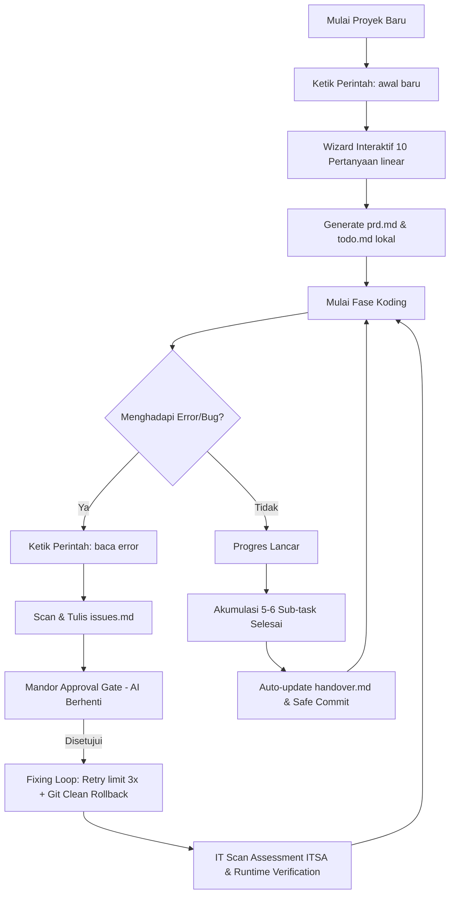

# Brainvibes Configuration System

Repositori ini menyimpan berkas konfigurasi utama untuk standardisasi, otomatisasi, dan pengamanan koding berbasis AI pada ekosistem **Gemini CLI**, **Antigravity CLI**, dan **Antigravity IDE**.

---

## 📂 Berkas Utama

1. **[gemini.md](gemini.md) (Otak)**
   * Berisi *Global System Instructions* untuk mengarahkan model kecerdasan buatan (LLM) agar patuh pada aturan interaksi linear, penanganan terminal multi-OS (Windows/Unix), pencegahan bias desain visual (Tonal Preservation Theme Matrix), dan alur siklus hidup otomatis (handover, commit, & YOLO debugging).
2. **[prd-template.md](prd-template.md) (Eksekutor / Template PRD)**
   * Berkas cetak biru *Product Requirements Document* (PRD) 10-poin yang dirancang khusus agar mudah diproses oleh agen AI. Dilengkapi dengan batasan desain visual (CSS root tokens), aturan path routing adaptif, serta penanda kondisional untuk proyek statis (HTML/CSS) maupun dinamis (SPA/Database).

---

## ⚙️ Alur Penggunaan & Integrasi Sistem

Untuk mengaktifkan konfigurasi ini secara global pada mesin kerja Anda, tempatkan kedua berkas tersebut pada direktori konfigurasi terminal AI dijalankan (contoh pada Windows: `C:\Users\<Username>\.gemini\`). AI akan secara otomatis membaca instruksi sistem global ini di setiap sesi kerja baru.

### 1. Fase Inisiasi (Perintah: `awal baru`)
* Pemicu alur pembuatan PRD secara interaktif. AI memandu wawancara wizard 10-poin secara bertahap (satu pertanyaan per giliran obrolan) untuk mengunci parameter tech stack, kluster akses rute, geometri elemen visual, palet warna, captcha, dan SEO metadata.
* Setelah konfirmasi selesai, AI akan membuat dokumen `prd.md` dan checklist linear koding `todo.md` di direktori lokal proyek.

### 2. Fase Kontinuitas (Perintah: `awal lanjut`)
* AI memulihkan ingatan sesi kerja (*State Restoring*) secara senyap dengan membaca file `prd.md`, `todo.md`, `handover.md`, dan pangkalan data teknis `/.docs/`.
* Setiap kali ada akumulasi **5 hingga 6 sub-task** selesai dicentang (`- [x]`), AI secara otomatis memperbarui dokumen pelacakan harian `handover.md` (Milestone Timeline) dan memicu git commit dengan pengaman autounstage kredensial.

### 3. Fase Debugging & Pemeliharaan (Perintah: `baca error`)
* AI mengaktifkan **Mode YOLO (Zero Compromise)** untuk mendeteksi silent visual error, kebocoran tipe data, dan port dev server yang hang.
* AI mencatat temuan bug pada `/.docs/issues.md` dan menghentikan koding untuk meminta persetujuan developer (Mandor Approval Gate).
* AI melakukan perbaikan bertahap (maksimal 3 kali percobaan per titik error). Jika gagal, AI membatalkan mutasi kode dan membersihkan file sampah (*Git Clean Rollback*).
* Pasca-fix berhasil, AI memvalidasi runtime log di `.scratchpad/dev-server.log` dan menjalankan **IT Scan Assessment (ITSA / 5 Lapisan Scan)** sebelum status ditandai `RESOLVED`.

---

## 📊 Matriks Kelebihan Penggunaan (Comparison Matrix)

| Aspek / Fitur | Menggunakan Brainvibes (2 File Konfigurasi) | Tanpa Brainvibes (Default AI/Ad-hoc Coding) |
| :--- | :--- | :--- |
| **Konsistensi Desain & Estetika Visual** | **Premium & Konsisten.** Menggunakan *Tonal Preservation Theme Matrix* via variabel CSS root. Light Mode mempertahankan DNA warna asli palet, Dark Mode berupa rona malam (Deep Tonal) dari warna dasar yang sama. Bebas dari risiko teks tidak terbaca (teks gaib). | **Biasa & Inkonsisten.** AI sering meng-hardcode warna putih (#FFF) atau hitam (#000) hambar korporat yang pecah, atau menghasilkan teks abu-abu di atas latar abu-abu yang melanggar rasio kontras. |
| **Keamanan Kredensial & Repositori Git** | **Sangat Aman.** Secara otomatis membersihkan cache Git index dan meng-unstage file sensitif (`.env*`, `handover.md`, `prd.md`, `todo.md`, database lokal, file JSON kredensial) pada setiap komit, baik auto-commit harian maupun komit manual berulang. | **Bocor.** File rahasia seperti `.env`, database SQLite development, password seeder, serta file internal AI sering tidak sengaja masuk ke daftar *staged files* dan ter-push ke GitHub publik. |
| **Penanganan Bug & Debugging (YOLO Mode)** | **Sistematis & Kebal Stuck.** Memiliki jurnal percobaan (`issues.md`), pembatasan retry 3x dengan auto rollback git clean (menghapus untracked files), pelepasan zombie port server otomatis, isolasi timeout API pihak ketiga (mock fallback), dan IT Scan Assessment (ITSA) pasca-fix. | **Looping Tanpa Batas.** AI sering terjebak dalam loop bolak-balik mengubah 2 metode salah yang sama secara bergantian, menyembunyikan log compiler stderr ke null, atau macet akibat port bentrok. |
| **Ingatan Progres Sesi Kerja (State Retention)** | **Amnesia Nol.** Menggunakan berkas pelacak `handover.md` dengan kapasitas rolling FIFO buffer 100 baris. AI sesi berikutnya langsung memahami status terakhir aplikasi, komponen baru terpasang, port aktif, dan data simulator tanpa memindai dari awal. | **Mudah Lupa.** Saat batas token context terlampaui, AI akan lupa progres tugas yang sudah selesai, lupa manifest rute halaman fisik yang telah dibuat, dan rentan menulis ulang kode komponen yang sudah ada (code bloating). |
| **Alur Komunikasi & Perencanaan** | **Taktis & Efisien.** Wawancara Wizard linear 1-per-1 memastikan tech stack dan rancangan visual dikunci di awal. AI hanya diperbolehkan menulis kode setelah draf PRD disetujui, dan dilarang basa-basi kosmetik (Zero-Fluff Filter). | **Tebak-tebakan / Overwhelming.** AI sering membuat asumsi arsitektural sendiri secara sepihak, atau langsung menulis kode tanpa PRD terstruktur, serta memberondong 10 pertanyaan sekaligus dalam satu giliran chat. |
| **Kepatuhan Arsitektur Kode (Immutable Core)** | **Terisolasi & Modular.** Memisahkan secara ketat Presentation Layer, Logic Layer, dan Data Access. Logika transaksi database wajib menggunakan ACID transaction wrapper (`DB::beginTransaction`). Fitur ekspor berkas besar wajib menerapkan Lazy Loading. | **Spaghetti Code.** Kode sering menumpuk menjadi satu file panjang (monolit kaku), data transfer langsung dari UI ke database tanpa validasi, link mati (`href="#"`), dan bundle size membengkak karena library pihak ketiga yang diimpor global. |
