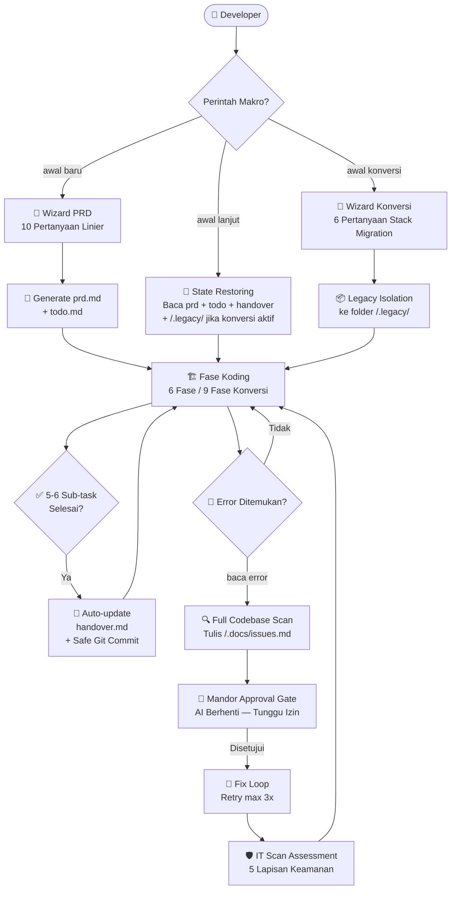

<div align="center">

# 🧠 Brainvibes

### _Global AI Coding Configuration System_

**Tiga berkas. Satu standar. Nol kompromi.**

[](https://github.com/Noisesless/brainvibes)
[](https://github.com/google-gemini/gemini-cli)
[](#)
[](#)
[](LICENSE)

---

*Sistem instruksi global berbasis Markdown untuk menstandarisasi, mengamankan,*
*dan mengotomasi seluruh siklus hidup proyek kode yang dibangun bersama AI.*

</div>

---

## 📌 Apa Itu Brainvibes?

**Brainvibes** adalah sistem konfigurasi tiga berkas yang bertindak sebagai **"DNA Otak"** dari setiap sesi coding berbasis AI. Dengan menempatkan ketiga berkas ini di direktori konfigurasi terminal AI Anda, agen AI (seperti Gemini CLI atau Antigravity IDE) akan secara otomatis membaca dan mematuhi seluruh aturan interaksi, keamanan, estetika visual, dan alur kerja yang telah Anda tetapkan — **di setiap sesi kerja baru, tanpa perlu konfigurasi ulang**.

> Dirancang khusus untuk developer yang ingin AI-nya **bekerja seperti senior engineer berpengalaman** — bukan seperti autocomplete yang asal jalan.

---

## 📂 Tiga Berkas Inti

<table>
<tr>
<td width="33%" valign="top">

### 🧠 [`gemini.md`](gemini.md)
**Otak — Global System Instructions**

Berkas perintah makro dan hukum perilaku AI. Mencakup:

- **4 Makro Command** (`awal baru`, `awal lanjut`, `awal konversi`, `baca error`)
- **Wizard PRD Interaktif** — 10-poin wawancara linier 1-per-giliran
- **Anti-Looping Engine** — Retry limit 3x + Git Clean Rollback otomatis
- **Handover Auto-Log System** — Rolling FIFO buffer 100 baris per 5–6 sub-task selesai
- **ACID Transaction Guard** — Wajib `DB::beginTransaction` pada mutasi data multi-tabel
- **Port Collision Auto-Recovery** — Deteksi zombie process + increment port otomatis
- **Git Security Protocol** — Auto-unstage `.env*`, `handover.md`, `prd.md`, `todo.md`, kredensial DB sebelum setiap commit

</td>
<td width="33%" valign="top">

### 📋 [`prd-template.md`](prd-template.md)
**Eksekutor — Blueprint PRD 11-Bab**

Template cetak biru *Product Requirements Document* berstruktur tinggi. Mencakup:

- **Bab 1–2** — Identitas proyek & tech stack (stack detector otomatis)
- **Bab 3** — Visual DNA System: Referensi silang ke `design-system.md`
- **Bab 4** — Layout Engine: Zero-Dead-End Links, Z-Index Map, Sidebar Anti-Collapse
- **Bab 5** — Component Registry: Button, Toast, Skeleton, Modal, Captcha
- **Bab 6** — Data Flow, Auth Ecosystem, Upload Pipeline (WebP Auto-Crop 1:1)
- **Bab 7** — Security: Route Guarding 3-Zona, Captcha High-Contrast, Rate Limiting 5/15min
- **Bab 8** — Git Governance & Isolated Scratchpad Zone
- **Bab 9** — SEO + Open Graph (TikTok / WhatsApp / Instagram ready)
- **Bab 10** — ASCII Tree Map (Native PHP & Modern Bundler)
- **Bab 11** — Transition Blueprint Registry *(khusus mode `awal konversi`)*

</td>
<td width="33%" valign="top">

### 🎨 [`design-system.md`](design-system.md)
**Visual — Token & Palet**

Berkas spesifikasi desain dan komponen visual. Mencakup:

- **Tonal Preservation Theme Matrix** — 15 Master Palet 2026
- **CSS Root Tokens** — Standarisasi variabel `--vibe-*`
- **Typography Lock** — Sistem font untuk hierarki teks
- **Dark Mode Engine** — Berbasis Deep Tonal (bukan hitam murni)

</td>
</tr>
</table>

---

## ⚡ Instalasi Cepat (2 Langkah)

```bash
# 1. Clone repositori ini
git clone https://github.com/Noisesless/brainvibes.git

# 2. Salin ketiga berkas ke direktori konfigurasi AI Anda
#    Windows (Gemini CLI / Antigravity IDE):
copy brainvibes\gemini.md      %USERPROFILE%\.gemini\gemini.md
copy brainvibes\prd-template.md %USERPROFILE%\.gemini\prd-template.md
copy brainvibes\design-system.md %USERPROFILE%\.gemini\design-system.md

#    Unix / macOS:
cp brainvibes/gemini.md       ~/.gemini/gemini.md
cp brainvibes/prd-template.md ~/.gemini/prd-template.md
cp brainvibes/design-system.md ~/.gemini/design-system.md
```

> ✅ Selesai. AI Anda akan langsung membaca instruksi ini di sesi berikutnya secara otomatis.

---

## 🎮 4 Makro Command Utama

Ketik perintah di bawah sebagai **kalimat pertama** pada sesi chat AI Anda:

<table>
<tr>
<th width="20%">Command</th>
<th width="30%">Mode Yang Aktif</th>
<th width="50%">Kapan Digunakan</th>
</tr>
<tr>
<td><code>awal baru</code></td>
<td>🏗️ Fase Inisiasi</td>
<td>Memulai proyek dari nol. AI memandu wawancara wizard PRD 10-poin secara linier sebelum menulis satu baris kode pun.</td>
</tr>
<tr>
<td><code>awal lanjut</code></td>
<td>🔄 Kontinuitas Harian</td>
<td>Melanjutkan sesi kerja. AI memulihkan memori dari <code>prd.md</code>, <code>todo.md</code>, <code>handover.md</code>, dan folder <code>/.docs/</code> secara senyap.</td>
</tr>
<tr>
<td><code>awal konversi</code></td>
<td>🔀 Re-Platforming</td>
<td>Migrasi stack teknologi lama ke baru (Strangler Fig Pattern). Isolasi <code>/.legacy/</code>, wizard 6-pertanyaan, 9-fase migrasi atomik.</td>
</tr>
<tr>
<td><code>baca error</code></td>
<td>🔥 YOLO Debug Mode</td>
<td>Debugging global tanpa kompromi. AI scan seluruh codebase, tulis <code>issues.md</code>, lalu berhenti dan minta persetujuan developer sebelum memperbaiki.</td>
</tr>
</table>

---

## 🔄 Alur Kerja Sistem



---

## 📊 Kenapa Brainvibes? (Comparison Matrix)

| Fitur | ✅ Dengan Brainvibes | ❌ Tanpa Brainvibes |
| :--- | :--- | :--- |
| **Konsistensi Desain Visual** | Premium & konsisten. *Tonal Preservation Matrix* — Light Mode mempertahankan DNA warna asli palet. Dark Mode = Deep Tonal dari spektrum yang sama. | AI hardcode `#FFF` / `#000` hambar, teks abu-abu di atas latar abu-abu, risiko teks tak terbaca tinggi. |
| **Keamanan Kredensial Git** | Auto-unstage `.env*`, `handover.md`, DB lokal, kredensial JSON sebelum **setiap** commit — otomatis, tanpa perlu ingat. | File rahasia sering ter-push ke GitHub publik secara tidak sengaja. |
| **Debugging (YOLO Mode)** | Sistematis: jurnal retry `issues.md`, batas 3x percobaan, rollback `git clean`, zombie port release, mock API fallback, ITSA pasca-fix. | AI looping tanpa batas, stderr tersembunyi ke null, port bentrok dibiarkan hang. |
| **Ingatan Antar Sesi (State)** | Nol amnesia. `handover.md` dengan FIFO rolling buffer 100 baris — AI berikutnya langsung tahu status, port aktif, dan komponen terpasang. | Saat token context penuh, AI lupa rute halaman yang sudah dibuat dan menulis ulang komponen (code bloating). |
| **Perencanaan Proyek** | Wizard PRD linier 1-per-giliran. Kode baru ditulis **setelah** PRD disetujui. Zero-Fluff Filter aktif. | AI langsung koding tanpa rencana, asumsi arsitektur sepihak, 10 pertanyaan sekaligus dalam satu chat. |
| **Mode Konversi Stack** | Strangler Fig Pattern: isolasi `/.legacy/`, 9-fase atomik, Git checkpoint per fase, Legacy Purge Gate dengan dry-run log. | Tidak ada pola terstruktur — migrasi ad-hoc, rawan fitur terlewat dan data hilang. |
| **Arsitektur & Kepatuhan Kode** | Strict layer separation (Presentation → Logic → Data), ACID transaction guard, Lazy Loading ekspor, Zero-Dead-End Link Policy. | Spaghetti code, query DB langsung dari UI, link mati `href="#"`, bundle size membengkak. |

---

## 🛡️ Fitur Keamanan Unggulan

```
┌─────────────────────────────────────────────────────────┐
│              5 LAPISAN SCAN KELAYAKAN (ITSA)            │
├─────────┬───────────────────────────────────────────────┤
│ Layer 1 │ Linting Check — ESLint / PHP Pint / Prettier  │
│ Layer 2 │ Deep Scan Type-Safety — Compiler strict mode  │
│ Layer 3 │ SAST Analysis — Celah dependensi & hardcoded  │
│         │ secret detection                              │
│ Layer 4 │ Form Input Validation Guard — Anti SQL Inject │
│         │ & XSS, Rate Limiting 5 attempts / 15 menit   │
│ Layer 5 │ Auth Integrity Verification — Session/JWT     │
│         │ lifecycle check + Route Guard 3-Zona          │
└─────────┴───────────────────────────────────────────────┘
```

---

## 🎨 15 Master Palet Warna 2026 (design-system.md)

Brainvibes menyertakan sistem pemilihan palet warna bertingkat yang dipisahkan ke dalam `design-system.md`, dikunci ke dalam **CSS Custom Properties (`--vibe-*`)** dan divalidasi secara kontras (`min ratio 4.5:1`) sebelum ditulis ke disk:

| Cluster | Nama Palet | Karakter |
| :--- | :--- | :--- |
| 🌑 Gelap | Obsidian Forge, Cyber Industrial, Carbon Slate | Dark-first, kontras ekstrem |
| 🌿 Alam | Forest Sage, Earthy Terracotta, Ocean Teal | Organik, hangat, tenang |
| ☀️ Terang | Ivory Cream, Arctic White, Lavender Mist | Minimalis, bersih, terang |
| 🔥 Vibrant | Neon Pulse, KTM Orange, Kawasaki Green, Cobalt Blue | Streetwear, berani, saturasi tinggi |
| ⚖️ Netral | Corporate Slate, Graphite Professional | Formal, enterprise, korporat |

> Jika memilih opsi **RANDOM**, nama kluster pemenang akan dicetak ke terminal saat serah terima `prd.md`.

---

## 📁 Struktur Direktori Proyek Yang Dihasilkan

```
/[nama-proyek]/
├── /.docs/               ← Pusat dokumentasi teknis inti (wajib ada)
│   ├── architecture.md   ← Aliran data makro (Presentation → Logic → DB)
│   ├── api-spec.md       ← Spesifikasi endpoint & server actions
│   ├── database.md       ← Schema DDL SQL / Local JSON State blueprint
│   └── issues.md         ← Bug tracker FIFO (max 10 resolved, OPEN wajib dipertahankan)
├── /.scratchpad/          ← Zona debug terisolasi (Git-Ignored otomatis)
├── /src/ atau /app/       ← Source code aplikasi utama
├── /public/ atau /assets/ ← Aset statis + fallback image WebP
├── .env                   ← Konfigurasi sensitif (tidak pernah masuk Git)
├── .env.example           ← Template kunci tanpa nilai asli
├── .gitignore             ← Proteksi otomatis sejak detik pertama proyek
├── handover.md            ← State tracker harian (Git-Ignored)
├── prd.md                 ← Dokumen spesifikasi proyek (Git-Ignored)
└── todo.md                ← Checklist koding berjenjang (Git-Ignored)
```

---

## 📈 Riwayat Versi & Changelog

| Versi | Commit | Ringkasan Perubahan |
| :--- | :--- | :--- |
| `v2.0.0` | [`8fcf799`](https://github.com/Noisesless/brainvibes/commit/8fcf799) | Fix 8 celah lanjutan: rename `## 2. Environment & Local Settings`, standardisasi log `## 10.`, tutup unclosed code block, deteksi `/.legacy/` untuk konversi, ASCII tree kondisional, cross-ref Section 11→6D |
| `v1.9.0` | [`d588ac1`](https://github.com/Noisesless/brainvibes/commit/d588ac1) | Fix 7 konflik `awal konversi`: wizard 6-langkah, 9-fase atomik, klarifikasi `git mv` vs filesystem move, tracking `/.legacy/`, kolom Status Porting Section 11, handover trigger, Git checkpoint per fase |
| `v1.8.0` | [`bba7771`](https://github.com/Noisesless/brainvibes/commit/bba7771) | Hardened `baca error`: port sync API, linter auto-fix trap, db lock clearance, static frontend bypass |
| `v1.7.0` | [`5a6f93f`](https://github.com/Noisesless/brainvibes/commit/5a6f93f) | Integrasi ITSA post-fix assessment ke mode `baca error` |

---

## 🤝 Kontribusi

Pull request dan issue sangat disambut! Jika kamu menemukan celah instruksi, konflik logika, atau ingin menambahkan dukungan framework baru ke dalam template, silakan buka **Issue** terlebih dahulu untuk diskusi.

```
1. Fork repositori ini
2. Buat branch fitur: git checkout -b feat/nama-fitur-kamu
3. Commit perubahan: git commit -m "feat: deskripsi perubahan"
4. Push ke branch: git push origin feat/nama-fitur-kamu
5. Buka Pull Request ke branch main
```

---

<div align="center">

**Dibuat dengan ☕ dan obsesi terhadap kode yang rapi.**

[](https://github.com/Noisesless/brainvibes)
[](https://github.com/Noisesless/brainvibes/fork)

*Brainvibes — karena AI yang baik butuh instruksi yang lebih baik.*

</div>
